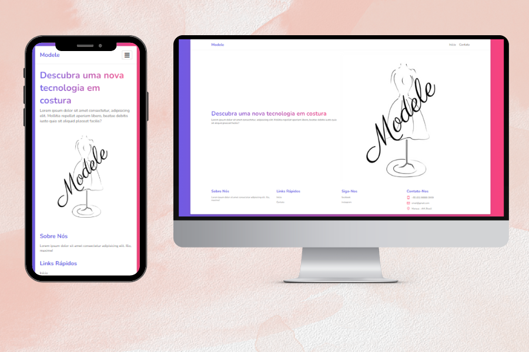

<h1 align="center"> Modele </h1>

Site desenvolvido para um aplicativo voltado para o ramo de costura.

  <a href="#-tecnologias">Tecnologias</a>&nbsp;&nbsp;&nbsp;|&nbsp;&nbsp;&nbsp;
  <a href="#-projeto">Projeto</a>

 

  

## 🚀 Tecnologias

Esse projeto foi desenvolvido com as seguintes tecnologias:

- HTML
- CSS
- JavaScript
- Form

## 💻 Projeto

Site desenvolvido para um aplicativo de costura. Onde o usuário pode acessar para assim está conhecendo mais sobre o aplicativo.

Nele o usuário pode esta vendo mais sobre o aplicativo e outras coisas, dentre elas enviar um e-mail para dá alguma ideia ou mencionar alguma dificuldade que esteja tendo no uso do aplicativo.

---

  Feito com ♥ by Alexandre

